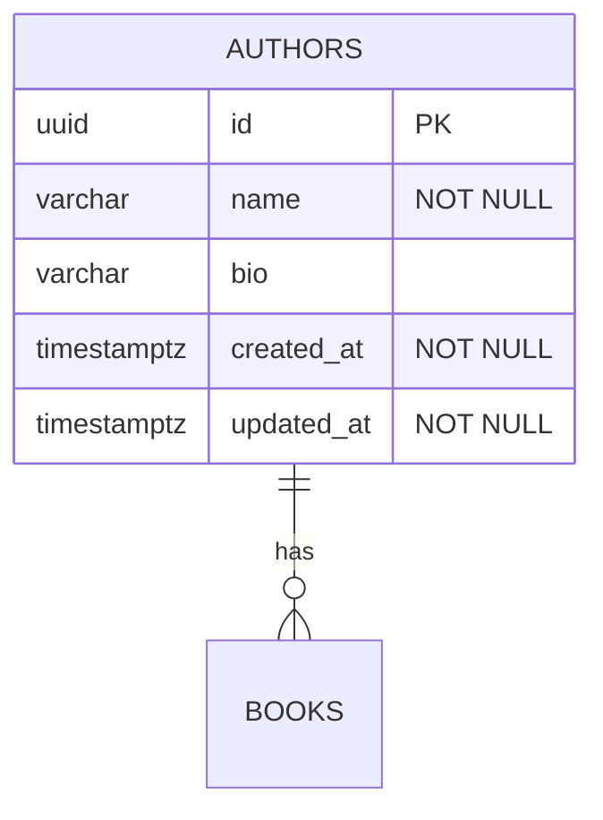

# Schema Gen

A CLI tool to automatically generate database schema diagrams from SeaORM entity definitions.

## Features

- **Automatic Generation**: Parses SeaORM entity files and generates diagrams
- **Multiple Formats**:
  - Mermaid (renders in GitHub/GitLab markdown)
  - DBML (for dbdiagram.io/dbdocs.io)
- **Relationship Detection**: Automatically extracts foreign key relationships
- **Type Mapping**: Converts Rust types to SQL types
- **Constraint Detection**: Shows primary keys, unique constraints, nullable fields

## Usage

### Basic Usage

Generate all diagram formats:
```bash
cargo run --bin schema-gen
```

### Options

```bash
# Specify entities path
cargo run --bin schema-gen -- --entities-path apps/zerg/api/src/entities

# Specify output directory
cargo run --bin schema-gen -- --output docs

# Generate only Mermaid format
cargo run --bin schema-gen -- --format mermaid

# Generate only DBML format
cargo run --bin schema-gen -- --format dbml

# Verbose output
cargo run --bin schema-gen -- --verbose

# Help
cargo run --bin schema-gen -- --help
```

## Output

### Mermaid (docs/schema.md)

Generates an ER diagram in Mermaid syntax that renders directly in markdown:



### DBML (docs/schema.dbml)

Generates DBML format compatible with dbdiagram.io:

```dbml
Table authors {
  id uuid [pk]
  name varchar [not null]
  bio varchar
  created_at timestamptz [not null]
  updated_at timestamptz [not null]
}

Ref: books.author_id > authors.id
```

## How It Works

1. **Parser**: Uses `syn` crate to parse Rust entity files
2. **Extraction**: Extracts:
   - Table names from `#[sea_orm(table_name = "...")]`
   - Fields and their types
   - Primary keys from `#[sea_orm(primary_key)]`
   - Relationships from `Relation` enum
3. **Generation**: Converts internal schema to Mermaid/DBML formats
4. **Output**: Writes diagram files to specified directory

## Integration Ideas

### Pre-commit Hook
Add to `.git/hooks/pre-commit`:
```bash
#!/bin/bash
cargo run --bin schema-gen
git add docs/schema.md docs/schema.dbml
```

### CI/CD
Add to GitHub Actions:
```yaml
- name: Generate schema diagrams
  run: cargo run --bin schema-gen
- name: Commit diagrams
  run: |
    git config user.name "GitHub Actions"
    git add docs/schema.md docs/schema.dbml
    git diff --quiet && git diff --staged --quiet || git commit -m "chore: update schema diagrams"
```

### Justfile
Add to `justfile`:
```just
schema:
    cargo run --bin schema-gen --verbose
```

## Type Mappings

| Rust Type | SQL Type |
|-----------|----------|
| Uuid | uuid |
| String | varchar |
| i32, i64 | integer |
| f32, f64 | float |
| bool | boolean |
| DateTime<Utc> | timestamptz |
| NaiveDate | date |
| NaiveDateTime | timestamp |
| Option<T> | nullable variant of T |

## Limitations

- Currently parses relationships from `Relation` enum attributes
- Does not extract index definitions (future enhancement)
- Simple pluralization logic (can be enhanced)
- Requires entities to follow SeaORM conventions

## Future Enhancements

- [ ] Extract indexes from migrations
- [ ] Support for composite keys
- [ ] Generate PlantUML format
- [ ] Add CASCADE information to diagrams
- [ ] Support for enum types
- [ ] Field-level comments from doc comments
- [ ] Interactive HTML diagram generation
