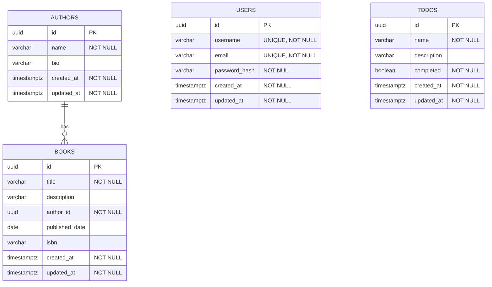

# Database Schema

Auto-generated from SeaORM entities on 2025-11-24 09:57:56 UTC

```mermaid
erDiagram
    AUTHORS ||--o{ BOOKS : "has"

    AUTHORS {
        uuid id "PK"
        varchar name "NOT NULL"
        varchar bio
        timestamptz created_at "NOT NULL"
        timestamptz updated_at "NOT NULL"
    }

    USERS {
        uuid id "PK"
        varchar username "UNIQUE, NOT NULL"
        varchar email "UNIQUE, NOT NULL"
        varchar password_hash "NOT NULL"
        timestamptz created_at "NOT NULL"
        timestamptz updated_at "NOT NULL"
    }

    TODOS {
        uuid id "PK"
        varchar name "NOT NULL"
        varchar description
        boolean completed "NOT NULL"
        timestamptz created_at "NOT NULL"
        timestamptz updated_at "NOT NULL"
    }

    BOOKS {
        uuid id "PK"
        varchar title "NOT NULL"
        varchar description
        uuid author_id "NOT NULL"
        date published_date
        varchar isbn
        timestamptz created_at "NOT NULL"
        timestamptz updated_at "NOT NULL"
    }

```
