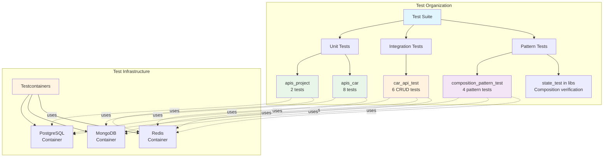
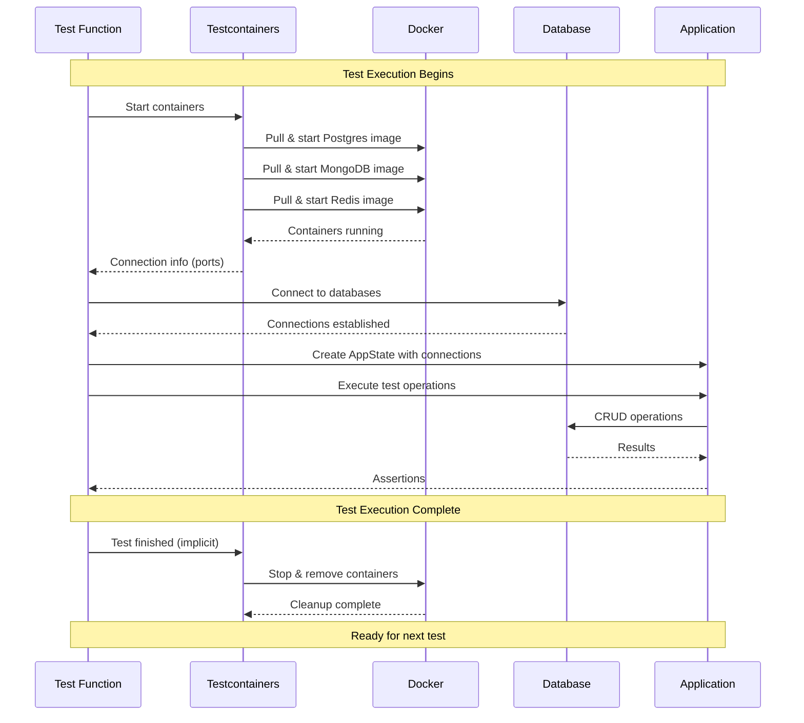
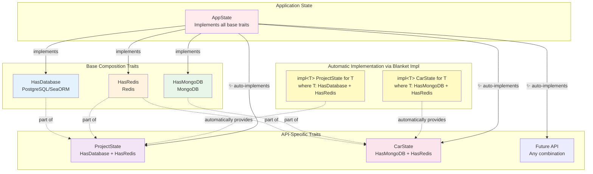
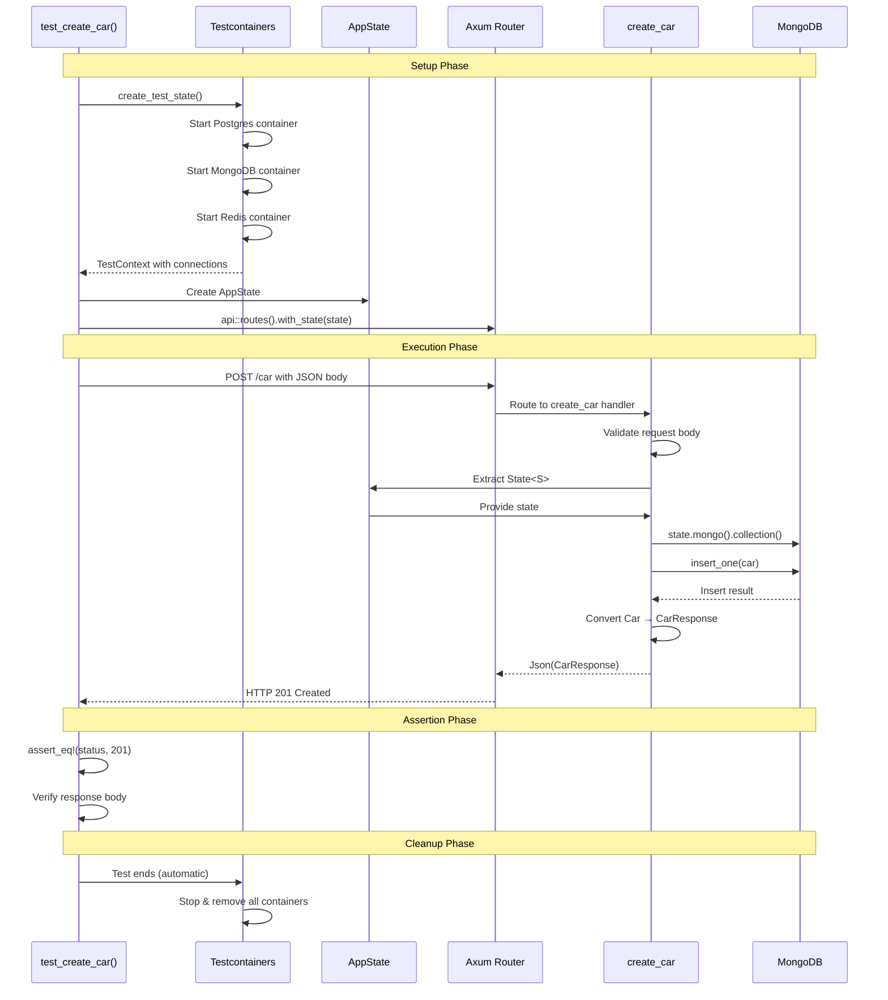
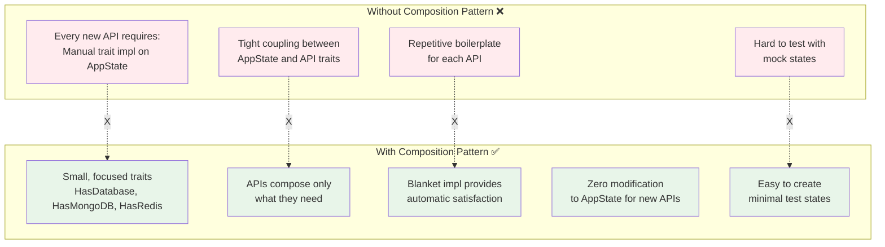
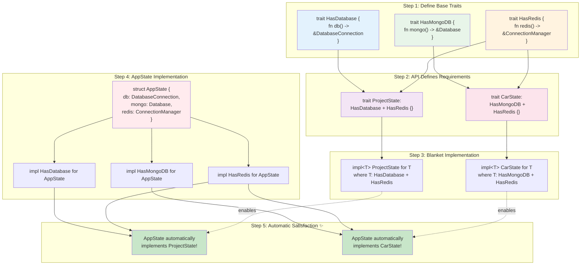
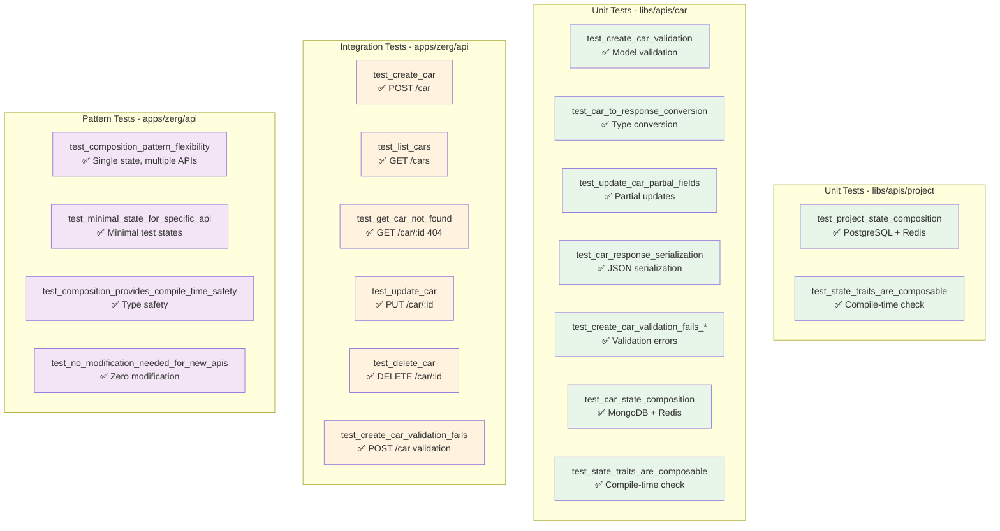
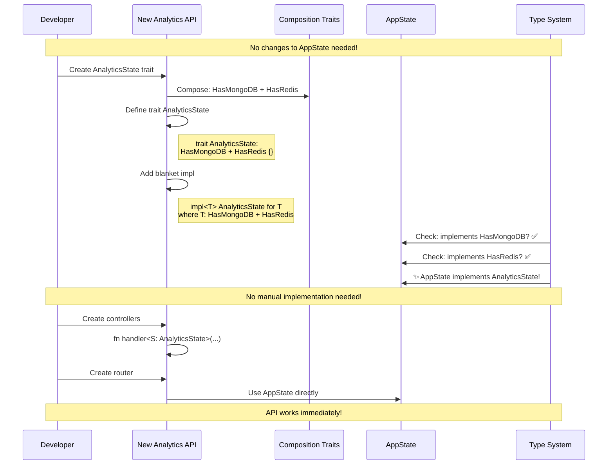
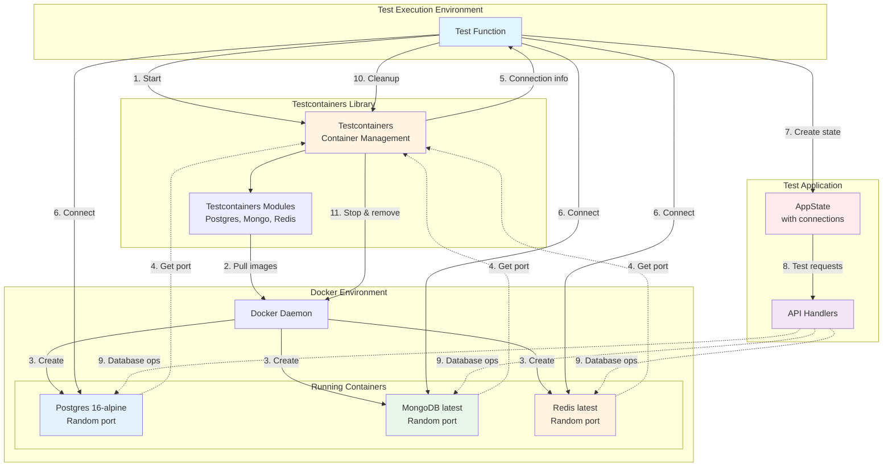

# Test Architecture & Composition Pattern

This document provides visual diagrams explaining the test structure, flows, and the composition pattern used in the Zerg API project.

## 1. Overall Test Structure

## 2. Testcontainers Lifecycle Flow

## 3. Composition Pattern: Trait Hierarchy

## 4. API Request Flow Through Layers

```mermaid
graph LR
    subgraph "HTTP Layer"
        A[HTTP Request<br/>POST /car]
    end

    subgraph "Router Layer"
        B[Axum Router<br/>car_router]
    end

    subgraph "Controller Layer"
        C[create_car&lt;S: CarState&gt;<br/>Validates request]
    end

    subgraph "State Extraction"
        D[State&lt;S&gt; extractor<br/>Provides state]
    end

    subgraph "Business Logic"
        E[Access state.mongo<br/>via trait method]
        F[MongoDB operations<br/>Insert document]
    end

    subgraph "Response"
        G[CarResponse<br/>JSON serialization]
        H[HTTP 201 Created]
    end

    A --> B
    B --> C
    C --> D
    D --> E
    E --> F
    F --> G
    G --> H

    style A fill:#e1f5ff
    style C fill:#fff4e1
    style E fill:#e8f5e9
    style G fill:#f3e5f5
```

## 5. Test Flow: Integration Test Example

## 6. Composition Pattern Benefits

## 7. State Trait Composition in Action

## 8. Test Coverage Matrix

## 9. Adding a New API: Zero Modification Flow

## 10. Testcontainers Architecture

## Key Takeaways

### Composition Pattern
- **Zero Boilerplate**: Adding new APIs requires zero modifications to AppState
- **Type Safety**: Compile-time verification that state has required dependencies
- **Flexibility**: Mix and match traits based on API needs
- **Testability**: Easy to create minimal mock states for testing

### Testcontainers Benefits
- **Self-Contained**: No external database setup required
- **Isolated**: Each test gets fresh containers
- **Portable**: Works on any machine with Docker
- **CI/CD Ready**: Perfect for automated testing pipelines
- **Real Databases**: Tests run against actual database engines, not mocks

### Test Coverage
- **20 total tests**: All passing with testcontainers
- **3 database types**: PostgreSQL, MongoDB, Redis
- **Multiple layers**: Unit, integration, and pattern tests
- **Complete CRUD**: Full coverage of API operations
- **Pattern verification**: Tests prove the composition pattern works
